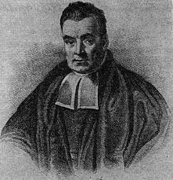

```{r setup, include=FALSE}
knitr::opts_chunk$set(echo = TRUE)
library(tidyverse)
```

# Quick primer on Bayesian inference

```{r echo=FALSE, out.width="20%", fig.align = "center"}

```

Bayesian inference is the empirical application of Bayes' rule.  Thomas Bayes (died 1761) was an English philosopher, statistian, and Presbyterian minister.

$$P(A|B)=\frac{P(B|A)P(A)}{P(B)}$$

>"Bayesian inference is the process of fitting a probability model to a set of data and summarizing the result by a probability distribution on the parameters of the model and on unobserved quantities such as predictions for new observations." --BDA 3 pg. 1

Two major types of statistical inference:

* Frequentist
* Bayesian

For a wonderfully written hypothetical debate between a non-Bayesian and a Bayesian see Andrew Gelman's paper [here](http://www.stat.columbia.edu/~gelman/research/published/badbayesmain.pdf).

## Tools for Bayesian inference

* Stan
* JAGS
* WinBUGS
* OpenBUGS

## Installing RStan

In addition to an install_packages("rstan") statement, RStan requires a C++ toolchain, and some configuration.  For Mac OS and Linux installs this [page](https://github.com/stan-dev/rstan/wiki/Installing-RStan-on-Mac-or-Linux) walks you through the steps.  For Windows, visit this [page](https://github.com/stan-dev/rstan/wiki/Installing-RStan-on-Windows).

I've got Rstan set up on this computer already, so I'll just load the library below.

```{r, warning = F, message = F}
library(rstan)
```


# Sea turtle bycatch example

```{r echo=FALSE, out.width="40%", fig.align = "center"}

```

Here we will use the observed annual counts of loggerhead bycatch from Hawaii's longline fishery.  Data is made available on online [here](http://www.fpir.noaa.gov/SFD/SFD_turtleint.html) if you want to play around with leatherback data too.

```{r}
turt_dat <- tibble(year = c(2004:2017),
                   count_lh = c(1, 12, 17, 15, 0, 3, 7, 12, 6, 6, 15, 13, 15, 21))
ggplot(data = turt_dat, aes(x = year, y = count_lh)) +
  geom_line()
```

### Modeling counts in Stan

Let $y$ be the annual observed sea turtle counts, and $\lambda$ be Poisson parameter.

$$p(\lambda|y)\propto Poisson(y|\lambda)p(\lambda)$$

Now, lets code up this model in Stan.  We'll start by going over the basic Stan template.  The stan_temp.stan file contains the fundamental programming blocks of a Stan program.  I'll use this template to build our first Poisson model in the file poisson_model.stan.

To estimate the model we'll run the following lines.  The first thing to note is Stan reads data as lists, so we'll need to convert our data frame into something Stan can read.

```{r}
stan_dat <- lst(y = turt_dat$count_lh,
                N = n_distinct(turt_dat$year))
```

Now we'll estimate the model by running the following lines.  The first part makes use of multiple cores to run seperate chains on each core.  General rule of thumb is more chains fewer iterations is better than chain more iterations.

```{r, echo = F, warnings = F, message = F}
rstan_options(auto_write = TRUE)
options(mc.cores = parallel::detectCores())

poisson_est <- stan("poisson_model.stan",
                    data = stan_dat,
                    iter = 1000,
                    chains = 4)
```

```{r}
print(poisson_est)
```

Once the model is estimated, we can make use of the generated quantities block we specified to view our posterior predictions.  We'll first want to transform our stanfit object into something like a tibble.

```{r}
samples <- as_tibble(extract(poisson_est))

ggplot(data = samples, aes(x = turt_pred)) +
  geom_histogram(bins = max(samples$turt_pred))
```

This is pretty cool. We can use the posterior samples to answer an interesting question.  What is the probability of catching 20 turtles or more?

```{r}
h1 <- length(samples$turt_pred[samples$turt_pred >= 20])
h1/length(samples$turt_pred)
```

### Revise the model with more information.

Let's revisit the model specifiation and add some information on number of sets from the annual Observer Program summaries posted [here](http://www.fpir.noaa.gov/OBS/obs_hi_ll_ss_rprts.html).

```{r}
turt_dat2 <- turt_dat %>%
  mutate(sets = c(88, 1604, 939, 711 + 656 + 128, 1487, 1833, 1879, 1579, 1307, 912, 1349, 1178, 778, 973))
```

We can now respecify the model to estimate lambda as an interaction rate parameter. We'll change the generate quantities block to look at the posterior predctions conditional on a year containing 2000 sets.

$$p(\lambda|y, sets)\propto Poisson(y|\lambda \times sets)p(\lambda)$$

```{r}
stan_dat2 <- lst(y = turt_dat2$count_lh,
                 sets = turt_dat2$sets,
                 N = n_distinct(turt_dat2$year))
```

```{r, echo = F, warnings = F, message = F}
rstan_options(auto_write = TRUE)
options(mc.cores = parallel::detectCores())

poisson_est2 <- stan("poisson_model2.stan",
                    data = stan_dat2,
                    iter = 1000,
                    chains = 4)
```

```{r}
print(poisson_est2)
```

# Deciding the amount of Observer coverage

One of the greatest features of Bayesian inference is applying the estimated model to a decision analysis problem.  Let's imagine we need to decide on the level of observer coverage.  We could observe every set, like we have in our previous data set, or we can observe some fraction of sets, which will reduce the costs of the program.

To solve this problem we'll interopolate set level data, then select some fraction to observe.

```{r}
set_dat <- tibble(set = integer(), year = integer(), inter = integer())
for (i in 2004:2017) {
  temp <- turt_dat2[turt_dat2$year == i,]
  x <- c(rep(0, temp$sets))
  while (sum(x) != temp$count_lh) {
    x <- rbinom(temp$sets, 1, temp$count_lh / temp$sets)
    }# create random set observations
  temp2 <- tibble(set = c(1:temp$sets), year = rep(i, temp$sets), inter = x)
  set_dat <- set_dat %>%
    bind_rows(temp2)
}
```

To confirm we did it right lets summarize at the year level and compare with original data.

```{r}
test <- set_dat %>%
  group_by(year) %>%
  summarize(count_lh_sim = sum(inter)) %>%
  left_join(turt_dat2, by = "year")
test
```

We can now explore the hypothetical case where we only observe half the sets.  To simulate this case, we'll just keep half of the set observations from each year, then summarize the data at the annual level.

```{r}
set_dat_obs <- set_dat %>%
  group_by(year) %>%
  filter(row_number() <= round(max(set) * 0.5, 1)) %>%
  summarize(lh_obs = sum(inter), sets_obs = max(set)) %>%
  left_join(turt_dat2, by = "year")
```

Now lets refit the model with simulated 50% Observer coverage, and predict the sea turtle catch as if we observed all the sets.

```{r}
stan_dat3 <- lst(y = set_dat_obs$lh_obs,
                 sets_obs = set_dat_obs$sets_obs,
                 sets = set_dat_obs$sets,
                 N = n_distinct(set_dat_obs$year))
```

```{r, echo = F, warnings = F, message = F}
rstan_options(auto_write = TRUE)
options(mc.cores = parallel::detectCores())

poisson_est3 <- stan("poisson_model3.stan",
                    data = stan_dat3,
                    iter = 1000,
                    chains = 4)
```

```{r}
print(poisson_est3)
```

Let's now compare our predicted turtle interactions (we'll use the median sample) to the observed level.

```{r}
obs_50 <- extract(poisson_est3, pars = "turt_pred")
obs_50 <- as_tibble(obs_50$turt_pred) %>%
  gather(key = year2, value = pred_inter) %>%
  group_by(year2) %>%
  summarize(med_inter = median(pred_inter)) %>%
  mutate(year = c(2004:2017)) %>%
  left_join(set_dat_obs, by = "year")

ggplot(data = obs_50) +
  geom_histogram(aes(x = med_inter), fill = "green", alpha = 0.5, bins = 10) +
  geom_histogram(aes(x = count_lh), fill = "black", alpha = 0.5, bins = 10)
  
```